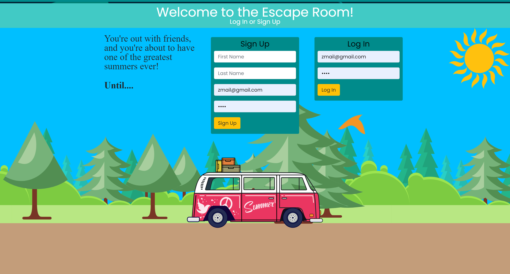
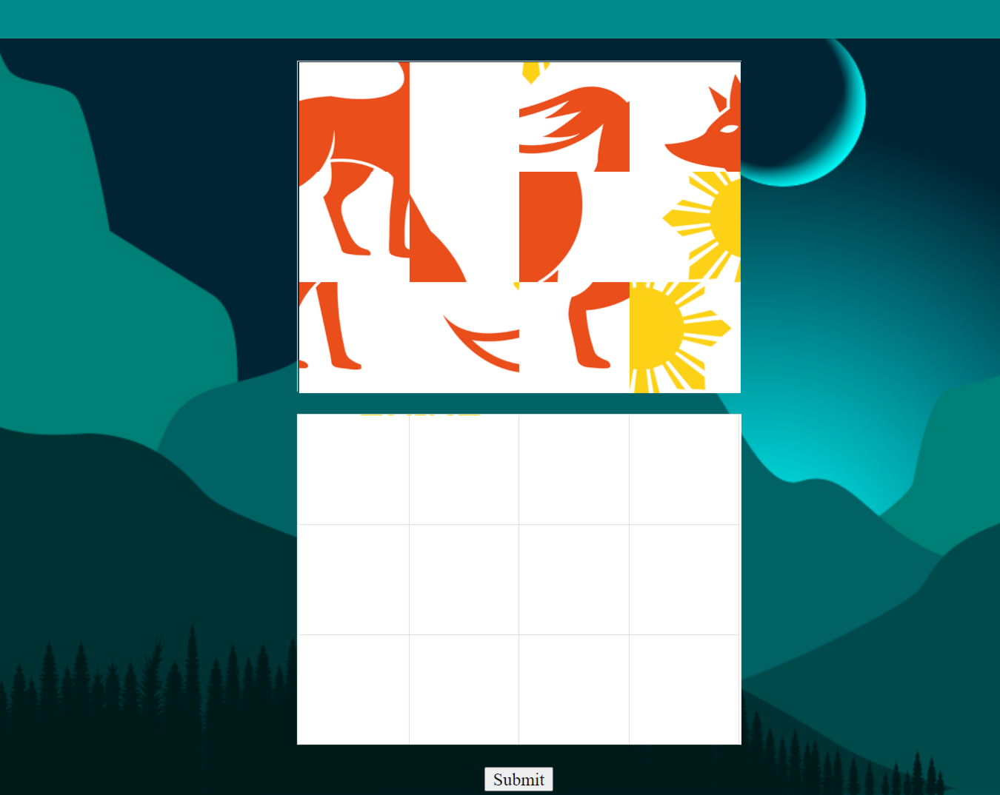
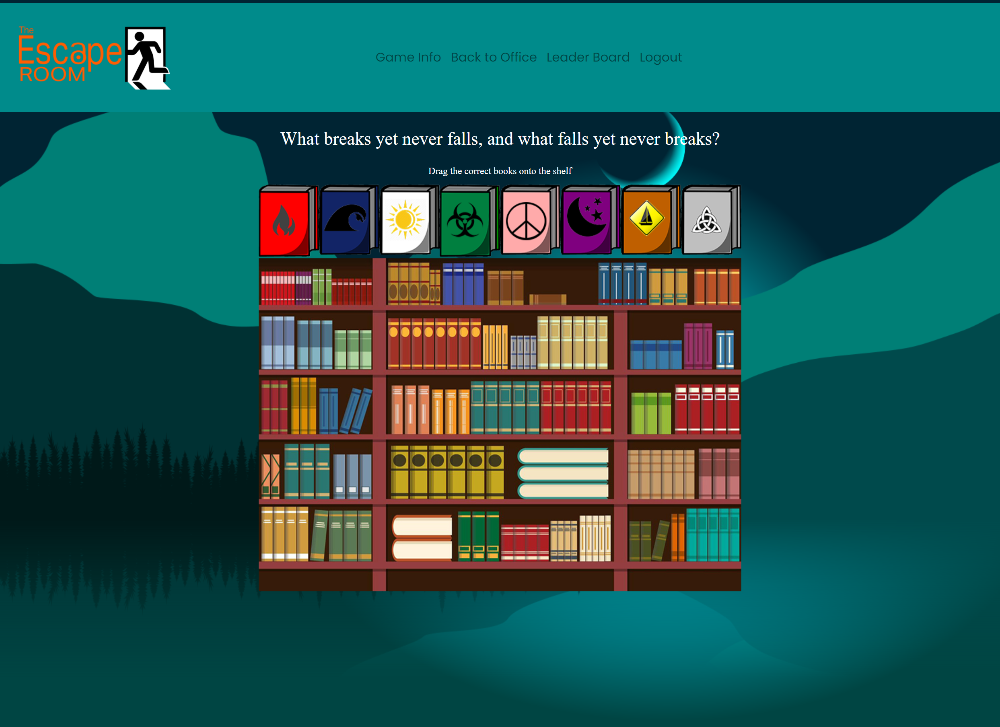

# Escape Room
Rachel Kroetch, Will Tham, Nicholas Werner, Pirooz Wallace, Paolo Rafael

## Deployed Site

https://react-escape-room.herokuapp.com/

## Table of Contents
* [Description](#description)
* [Deployed Site](#deployed-site)
* [Screenshots](#screenshots)
* [Installation](#installation)
* [Tech](#tech)
* [License](#license)
* [Questions](#Questions)
* [Credits](#Credits)
* [License](#license)

## Description
A virtual escape room where users will have to piece together clues and riddles in order to find a key and escape before the killer gets home.  Made using the MERN Stack. 2D game played by clicking / dragging on images to find clues and figure out puzzles and riddles. App has user authentication and stores save file with progress in Mongo database.

## Screenshots

## Installation

Heroku deployed site requires no installation. If you would like to install on your local machine then download source code and type in terminal :
` npm install ` to install dependencies and then start the app using ` npm start `.  

## Tech

* React
* Mongoose / Mongo DB
* Bcrypt
* Bootstrap / React-Bootstrap
* Express
* JWT
* Passport
* React-drag-drop-container
* Sweet Alert 2
* Heroku
* Cors
* Cookie Parser

## Questions

Email:

paolorafaelyap@gmail.com

ncwerner@gmail.com

rkroetch8@gmail.com

PiroozWallace@outlook.com

tham.will11@gmail.com

## Credits

[Rachel Kroetch](https://github.com/rekroetch)

[Pirooz Wallace](https://github.com/attack-theoRy)

[Nicholas Werner](https://github.com/ncwerner85)

[Paolo Rafael](https://github.com/paolorafaelyap)

[Will Tham](https://github.com/willtham1)

## License 

Copyright <2021> <Will Tham, Rachel Kroetch, Nicholas Werner, Paolo Rafael, Pirooz Wallace>

Permission is hereby granted, free of charge, to any person obtaining a copy of this software and associated documentation files (the "Software"), to deal in the Software without restriction, including without limitation the rights to use, copy, modify, merge, publish, distribute, sublicense, and/or sell copies of the Software, and to permit persons to whom the Software is furnished to do so, subject to the following conditions:

The above copyright notice and this permission notice shall be included in all copies or substantial portions of the Software.

THE SOFTWARE IS PROVIDED "AS IS", WITHOUT WARRANTY OF ANY KIND, EXPRESS OR IMPLIED, INCLUDING BUT NOT LIMITED TO THE WARRANTIES OF MERCHANTABILITY, FITNESS FOR A PARTICULAR PURPOSE AND NONINFRINGEMENT. IN NO EVENT SHALL THE AUTHORS OR COPYRIGHT HOLDERS BE LIABLE FOR ANY CLAIM, DAMAGES OR OTHER LIABILITY, WHETHER IN AN ACTION OF CONTRACT, TORT OR OTHERWISE, ARISING FROM, OUT OF OR IN CONNECTION WITH THE SOFTWARE OR THE USE OR OTHER DEALINGS IN THE SOFTWARE.